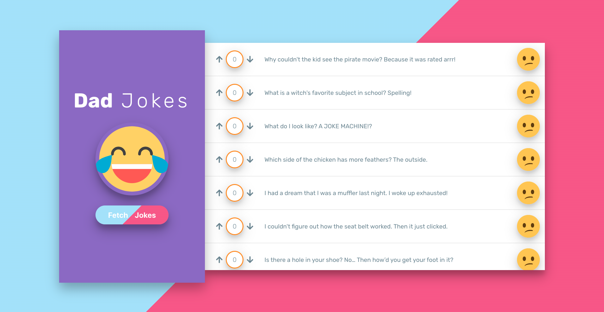

# Dad Jokes

This is a dad jokes app created as a part of The Modern React Bootcamp course on Udemy. It utilizes the icanhazdadjoke API, React lifecycle methods, and Axios to make requests to the API. 

<a href="https://ricardo-gonzalez-villegas.github.io/dad-jokes/">View it here.</a>

<h2>Technologies Used<h2/>
HTML, CSS, Javascript, React 
 
 icanhazdadjoke API
 https://icanhazdadjoke.com/api
 
 Axios
 https://github.com/axios/axios
  
<h1>Home Page</h1>

<h1>Voting</h1>

<h1>Fetching</h1>

